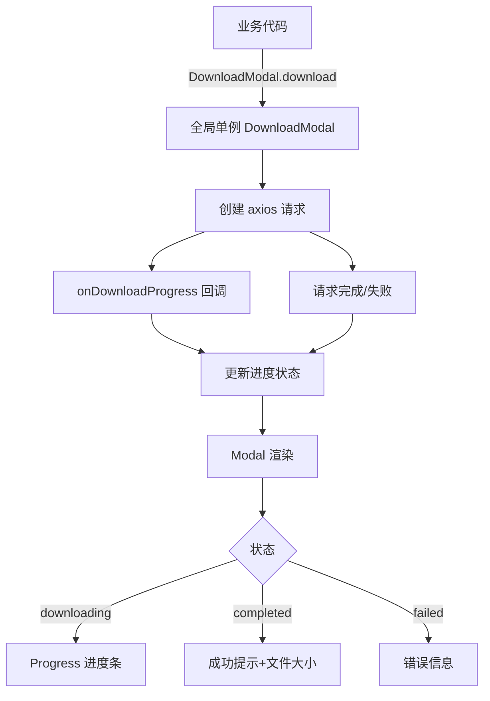

# DownloadModal 下载弹框组件设计

## 概述

全局下载弹框组件，替代现有 `DownloadFileButton` 和 `HttpUtils.downloadFile`，统一管理所有下载操作。

提供进度展示、状态反馈、断点重试等功能，业务方一行静态方法调用即可发起下载。

## 设计目标

- **简化使用**：业务方只需调用 `DownloadModal.download(options)`，无需维护弹框状态
- **统一体验**：所有下载操作使用同一弹框，体验一致
- **渐进增强**：进度、速度、状态反馈一键获得，无需业务方额外代码
- **消除重复**：移除 `DownloadFileButton` 和 `HttpUtils.downloadFile` 中的下载逻辑

## 组件架构



## API 设计

### 唯一公开方法

```typescript
interface DownloadOptions {
  url: string;                          // 下载接口地址
  params?: Record<string, any>;         // URL 查询参数
  data?: Record<string, any>;           // POST body（method=POST 时使用）
  method?: 'GET' | 'POST';             // HTTP 方法，默认 GET
  fileName?: string;                    // 下载文件名（可选，不传则从 Content-Disposition 解析）
}

DownloadModal.download(options: DownloadOptions): void;
```

### 使用示例

```jsx
// 默认 GET
DownloadModal.download({
  url: '/admin/report/export',
  params: { type: 'monthly', year: 2026, month: 7 },
})

// POST 请求
DownloadModal.download({
  url: '/admin/report/export',
  method: 'POST',
  data: { ids: ['1', '2', '3'] },
  fileName: '批量导出.xlsx',
})
```

## 内部实现

### 状态管理

```
state = {
  open: false,           // 弹框显隐
  status: '',            // idle | downloading | completed | failed
  fileName: '',          // 显示的文件名
  progress: 0,           // 0-100 百分比
  loaded: 0,             // 已下载字节数
  total: 0,              // 总字节数
  speed: '',             // 下载速度字符串（如 "2.3 MB/s"）
  errorMessage: '',      // 错误信息
}
```

### 进度计算

使用 axios 的 `onDownloadProgress` 回调：

```typescript
onDownloadProgress: (progressEvent) => {
  const { loaded, total } = progressEvent;
  const percent = total ? Math.round((loaded / total) * 100) : 0;
  // 通过时间差计算速度
  const now = Date.now();
  const elapsed = (now - lastTime) / 1000; // 秒
  const speed = elapsed > 0 ? (loaded - lastLoaded) / elapsed : 0;
  // 更新 state
  this.setState({ progress: percent, loaded, total, speed: formatSpeed(speed) });
  lastTime = now;
  lastLoaded = loaded;
}
```

### 单例模式

组件在 `constructor` 中挂载到 `DownloadModal.instance` 静态属性上。`DownloadModal.download()` 静态方法直接操作该实例的 state，并返回。

```typescript
class DownloadModal extends React.Component {
  static instance: DownloadModal | null = null;

  constructor(props) {
    super(props);
    DownloadModal.instance = this;
  }

  static download(options: DownloadOptions) {
    const instance = DownloadModal.instance;
    if (instance) {
      instance.startDownload(options);
    }
  }
}
```

### 下载流程

1. `DownloadModal.download(options)` 被调用
2. 如果有进行中的下载，自动终止前一个（AbortController）
3. 弹框显示，状态变为 `downloading`
4. 创建 axios 请求，设置 `responseType: 'blob'`
5. `onDownloadProgress` 持续更新进度条、已下载大小、速度
6. 请求完成 → 调用 blob 下载逻辑保存文件 → 状态变为 `completed`
7. 请求失败 → 状态变为 `failed`，显示错误信息

### Blob 保存逻辑

复用现有 `HttpUtils.handleDownloadBlob` 的核心思路，迁移到组件内部：

1. 检查响应 content-type，如果是 `application/json` 则解析为错误信息
2. 从 `Content-Disposition` 响应头解析文件名（如果调用方未提供 `fileName`）
3. 创建 Blob URL，模拟 `<a>` 点击触发下载

## 状态说明

| 状态 | 弹框行为 | 底部按钮 |
|------|---------|---------|
| downloading | maskClosable=false，无 X 关闭按钮，防止误中断 | 取消按钮（调用 AbortController.abort()） |
| completed | maskClosable=false，显示 X 关闭按钮，用户手动关闭 | 无额外按钮 |
| failed | maskClosable=false，显示 X 关闭按钮 | 重试按钮 |

## 文件变更清单

| 文件 | 操作 | 说明 |
|------|------|------|
| `web/src/framework/biz/DownloadFileButton.tsx` | 🗑 删除 | 被 DownloadModal 替代 |
| `web/src/framework/biz/index.tsx` | ✏️ 修改 | 移除 `DownloadFileButton` 导出 |
| `web/src/framework/utils/system/HttpUtils.js` | ✏️ 修改 | 移除 `downloadFile` 和 `handleDownloadBlob` 方法 |
| `web/src/framework/utils/system/HttpUtils.d.ts` | ✏️ 修改 | 移除 `downloadFile` 类型声明 |
| `README.md` | ✏️ 修改 | 更新 API 文档 |
| `web/src/framework/components/DownloadModal/index.tsx` | ✨ 新建 | 新组件 |
| `web/src/framework/components/index.ts` | ✏️ 修改 | 添加 `DownloadModal` 导出 |

## 未涉及的范围

- 批量队列下载：设计定位为单次下载，批量需求后续再扩展
- 下载速度平滑：采用简单滑动窗口计算，不做复杂平滑处理
